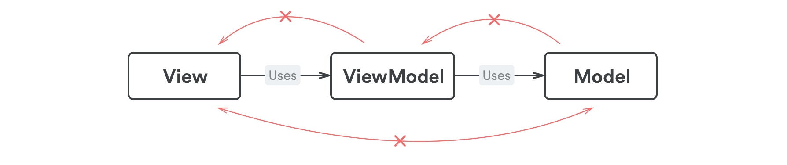
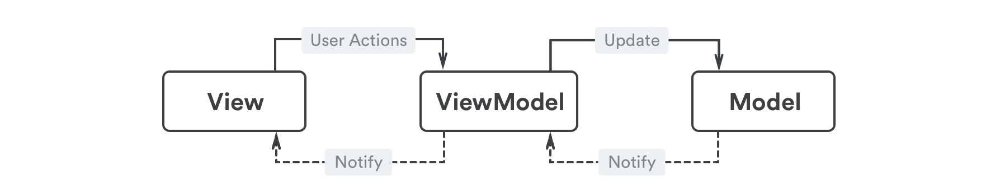
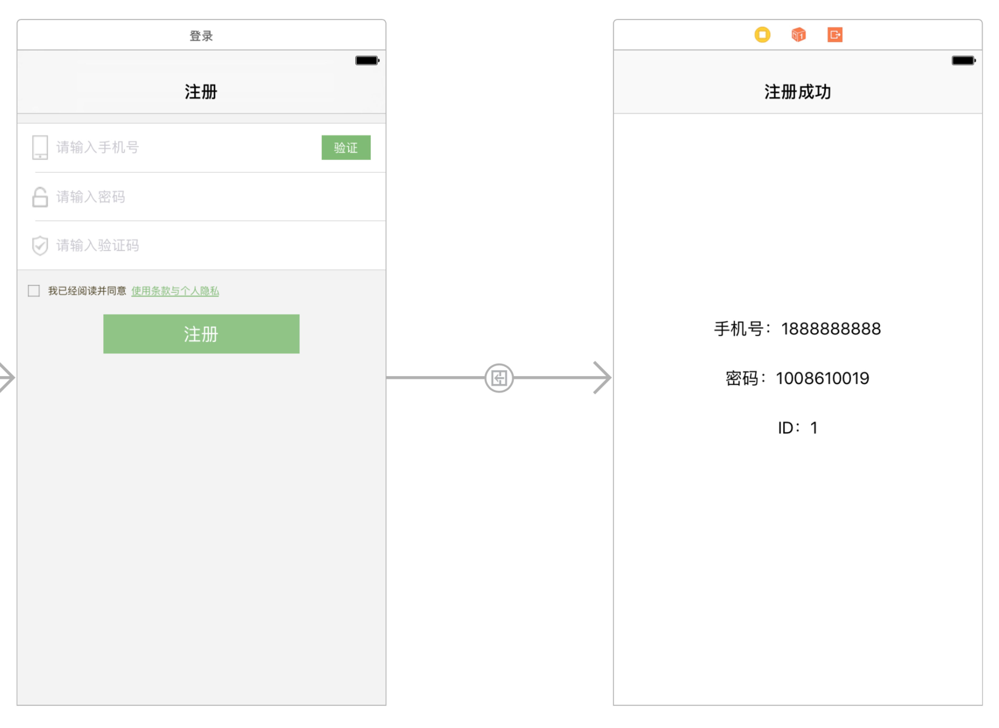

## ReactiveCocoa 5.0 与 MVVM 实践


### 几个重要原则



 View、ViewModel 和 Model 的依赖关系

#### 1. ViewModel 不依赖于 View

`MVVM` 依赖于数据的双向绑定，`View` 会依赖于 `ViewModel`， 由 `View` 来完成 `View` 与 `ViewModel` 之间的数据绑定，一旦绑定完成，`ViewModel` 中对应的数据发生改变，会通过信号发送事件，`View` 也会根据事件和数据更新界面。

`ViewModel` 是独立于 `View` 的， 这就意味着 `ViewModel` 不应该引入 `UIKit` ，这是一个比较重要和简单的检验标准：

	ViewModel 不应该引入 UIKit
	
 
 `ViewModel` 的这个特性意味着 `ViewModel` 可以方便的进行单元测试，要知道，当原先复杂的业务逻辑都聚集在 `ViewController` 或者或多或少依赖于 `View` 的时候，要做单元测试简直是噩梦。
 
#### 2. Model 不依赖于 ViewModel， 更加不依赖于 View
 
 同 `View` 与 `ViewModel` 的关系类似， `ViewModel` 依赖于 `Model`， 一般 `ViewModel` 会将原始的 `Model` 的数据做一定处理并且转换成可以直接显示在界面上的内容， `ViewModel` 可以直接修改 `Model` 的值， Model 中的内容发生改变必须通过间接的方式通知来告知 `ViewModel` （比如 `KVO` ），当然 `ViewModel` 收到通知改变对应的值， `View` 也会对应更新界面。
 
 
 实际上， 甚至可以说 `Model` 不依赖于 `Model` 以外的任何内容，是比较独立的存在。
 
 
 
 最后盗一张图，描述了三个内容之间的通讯（虽然上面的图也是盗的）
 


#### 3. View 和 Model 没关系

`View` 关心的只有 `ViewModel` ， 就算 `Model` 改名了，或者发生了重大的变更，也不会影响到 `View` 。
其实在 `MVC` 中， `View` 也是跟 `Model` 无关的， 但是传统的 `MVC`， `View` + `Controller` 往往就是 `ViewController`， 如果使用 `Xib` 或者 `Storyboard`， 还可以把 `View` 理解成 `nib` 文件，那倒可以解释。

在 `MVC` 中， `UIViewController` 是依赖于 `View` 的， 而在 `MVVM` 中， `UIViewController` 是一个单纯的 `View` ，依赖于 `ViewModel` 而不依赖于 `View`， `ViewModel` 中的数据是纯净的，和 `View` 中的元素一一对应的。


#### 4.对象的创建有讲究—— View 只能被 View 创建，  ViewModel 只能被 ViewModel 创建

- `View` 只能被 `View` 创建  

因为 `ViewModel` 不依赖于 `UIKit` ，自然无法创建 `View`， `Model` 就更别说了， 只要坚持原则一，这个错误自然不会犯

- `ViewModel` 只能被 `ViewModel` 创建

`View` 会依赖于 `ViewModel`， 但是 `View` 不应该负责 `ViewModel` 的创建，比如页面的跳转，`View` 需要从当前 `ViewModel` 获取到下一个 `ViewModel`， 子组件（ 如 cell ）， 对应的 `ViewModel` 也应该从父组件的 `ViewModel` 获取。

整个应用的第一个 `ViewModel` 可以由 `AppDelegate` 创建


### 开始动手





`注册` 基本是每个应用都会有的逻辑， 而注册的页面看似简单，逻辑确是相当复杂的，下面的列举下注册页面的几个基本需求：

- 发送验证码按钮
	- 判断手机号是否合法
	- 发送成功后进入倒计时，需要在按钮上动态显示倒计时
	- 倒计时期间无法发送
	- 倒计时结束后可以重新发送

- 注册按钮

	- 判断手机号是否合法
	- 判断密码是否合法
	- 判断验证码是否合法
	- 判断隐私协议勾选框是否勾选

像这样一个简单的表单，用传统的 `MVC` 写，其实也没多复杂的，需要监听每个输入框中内容的变化以及勾选框的变化，然后写两个判断方法（ `checkCanSendVerifyCode`,`checkCanRegister` ） 来返回按钮是否可点击更新页面状态控制事件， 需要编写两个按钮点击事件（ 发送验证码、注册），需要维护一个 `Timer` 来进行倒计时并且更新界面。

注册成功后，获取到新用户信息并且显示到下一个界面。

感兴趣的同学可以自己用传统的方式写一遍这个逻辑，其实坑还是有的 =.=

下面，我将尝试用 `ReactiveCocoa` 和 `MVVM` 的方式完成这个需求，看看最终的代码回事如何的。


### 分析数据流


我们先分析下这个界面上所对应的数据以及数据的流动：

#### View -> ViewModel 

数据 从 `View` 到 `ViewModel` 的单向流动，在 `ViewModel` 中，我们可以用 `Property` 来表示，代表一个特定类别的属性。

在这个 `Demo` 中，有几个属性只受用户操作变化，并不会自动发生变化， 包括

- phone 手机号输入框中的内容
- password 密码输入框的内容
- verifyCode 验证码输入框的内容
- checkBox  勾选框


所以在 `ViewModel` 中

```swift
class RegisterViewModel {
    let verifyCode: MutableProperty<String>
    let password: MutableProperty<String>
    let phone: MutableProperty<String>
    let isPolicyCheckd: MutableProperty<Bool>

    ///省略 init 中的初始化
}
```
在 `View` 中，完成绑定。

```swift
viewModel.phone <~ self.phoneNumberTextField.reactive.continuousTextValues.skipNil()
viewModel.password <~ self.passwordTextField.reactive.continuousTextValues.skipNil()
viewModel.verifyCode <~ self.verifyCodeTextField.reactive.continuousTextValues.skipNil()

// 这里没有办法通过数据绑定直接把 button.isSelected 映射到一个 property，所以这里采用
// 事件的方式修改 ViewModel 中的 Property， 并修改按钮的 isSelected 状态
self.checkBox.reactive.isSelected <~ viewModel.isPolicyCheckd        
self.checkBox.reactive.controlEvents(UIControlEvents.touchUpInside).observeValues { (button) in
            self.viewModel.isPolicyCheckd.value = !button.isSelected
        }
```
 
至此，我们完成了 `View` 到 `ViewModel` 的主要数据绑定


#### Valid 合法性检查

下面我们再分析要做哪些合法性检查。

- canSendVerifyCode  是否可以发送验证码，对应 verifyButton.isEnabled 
- canRegister  是否可以注册， 对应 registerButton.isEnabled


在 `View` 中
```swift 
verifyButton.reactive.isEnabled <~ viewModel.canSendAuthCode
registerButton.reactive.isEnabled <~ viewModel.canRegister
```

在 `ViewModel` 中

```swift

///countDown 是一个倒计时的属性，下面会讲
canSendAuthCode = phone.combineLatest(with: countDown).map({ (phone, count) -> Bool in
            return phone.characters.count == 11 && count <= 0
        })
       
///这里当然可以一口气 combine 了然后最后再 map ， 看个人习惯了
canRegister = phone.combineLatest(with: password).map({ (phone,password) -> Bool in
            return phone.characters.count == 11 && !password.isEmpty
        }).combineLatest(with: verifyCode).map({ (phoneAndPassword,verifyCode) -> Bool in
            return phoneAndPassword && verifyCode.characters.count == 4
        }).combineLatest(with: isPolicyCheckd).map({ (isAllFilled, isChecked) -> Bool in
            return isAllFilled && isChecked
        })

```

至此，我们完成了 按钮 enable 的控制


#### 验证码倒计时

验证码倒计时的逻辑是这样的： 发送验证码成功后开始倒计时，倒计时过程中发送验证码按钮不可点，并且显示倒计时秒数。

我们在 `ViewModel` 中控制倒计时， 通过一个 `countDown` 属性来描述当前的倒计时。

在 `View` 中：

```swift

verifyButton.reactive.title <~ viewModel.countDown.map({ (countDown) -> String in
            return countDown > 0 ? "\(countDown)" : "发送"
        })
        
```

这里对 `countDown` 使用了一个 `map`， 代表 `countDown` 为 0 的时候显示发送，否则显示秒数。


在 `ViewModel` 中：

```swift
 private func startTimer(){
        if let lastTimer = timer {
            lastTimer.invalidate()
            timer = nil
        }
        countDown.value = 60
        timer = Timer.scheduledTimer(withTimeInterval: 1.0, repeats: true, block: {
            [unowned self]
            _ in
            self.countDown.value -= 1
            if (self.countDown.value <= 0) {
                self.timer?.invalidate()
                self.timer = nil
            }
        })
    }
```

`timer` 控制 `countDown` 属性， `countDown` 影响按钮上的文字以及按钮的可点击性。


#### 事件处理

这里的事件其实分两类，一类是简单事件，一类是异步事件。

简单事件是 `checkBox` 的点击，是同步的。

```swift
self.checkBox.reactive.controlEvents(UIControlEvents.touchUpInside).observeValues { (button) in
            self.viewModel.isPolicyCheckd.value = !button.isSelected
        }
```

可以直接生成一个 `Signal`，并且 `observe` 即可。


异步事件包括发送验证码和注册，需要进行网络请求等待回调，这个时候需要借助 `SignalProducer` 

我们以发送验证码为例：

在 `View` 中：

```
verifyButton.reactive.pressed = CocoaAction(viewModel.sendAuthCode)


viewModel.register.values.observeValues { (viewModel) in
    guard let viewModel = viewModel else {
        return
    }
    self.performSegue(withIdentifier: "success", sender: viewModel)
}
```

这里 `viewModel.sendAuthCode` 是一个 `Action`，`Action` 会创建一个 `SignalProducer`， 每次事件触发的时候，`Action` 会 `start` 这个 `SignalProducer` 

具体在 `ViewModel` 中的代码如下：

```swift
register = Action<(),UserInfoViewModel?,NoError>(enabledIf:canRegister) {
            return self.createRegisterSignalProducer(phone: self.phone.value, password: self.password.value, verifyCode: self.verifyCode.value)
        }
        
        
        
private func createRegisterSignalProducer(phone: String, password:String, verifyCode:String) -> SignalProducer<UserInfoViewModel?,NoError> {
        let (signal,observer) = Signal<UserInfoViewModel?,NoError>.pipe()
        let signalProducer = SignalProducer<UserInfoViewModel?, NoError>(signal)
        UserService.register(withUsername: phone, password: password, verifyCode: verifyCode) {
            (user) in
            if let user = user {
                observer.send(value: UserInfoViewModel(user))
                observer.sendCompleted()
            } else {
                observer.send(value: nil)
            }
        }
        return signalProducer
    }
```

上述代码所做的就是在点击事件触发的时候生成一个 `SignalProducer`，并且调用了 `API`， `API` 调用结果通过 `observer` 来发送调用结果的相关数据。 `View` 订阅了 `Action` 的 `signal`，收到了回调数据后进行界面跳转。


####界面跳转

我们回头看下监听注册回调的方法：

```swift

viewModel.register.values.observeValues { (viewModel) in
    guard let viewModel = viewModel else {
        return
    }
    self.performSegue(withIdentifier: "success", sender: viewModel)
}

```

可以看到，这里可以获取到一个 `ViewModel`， 这个 `ViewModel` 是 `UserInfoViewModel` 是下一个界面所需要的 `ViewModel`， 这个 `ViewModel` 由 `RegisterViewModel` 根据 `Service` 接口返回的 `User` 的 `Model` 来创建，并且通过信号传递给 `View`


```swift
override func prepare(for segue: UIStoryboardSegue, sender: Any?) {
        // Get the new view controller using segue.destinationViewController.
        // Pass the selected object to the new view controller.
        if segue.identifier == "success" {
            let nextViewController = segue.destination as? UserInfoViewController
            nextViewController?.userInfoViewModel = sender as? UserInfoViewModel
        }
}

```
在这里吧 `viewModel` 赋值给下一个 `ViewController`，在下一个 `ViewController` 进而进行对应的数据绑定。


